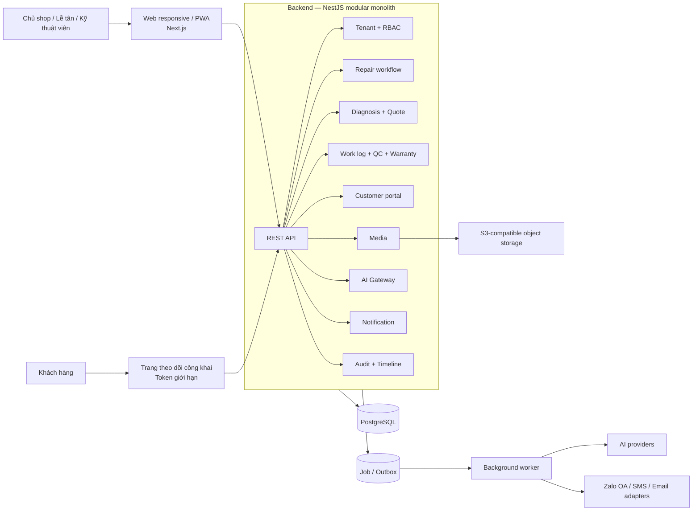
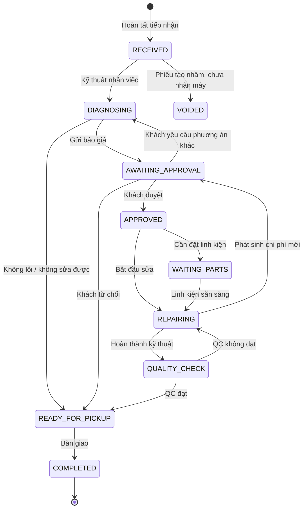
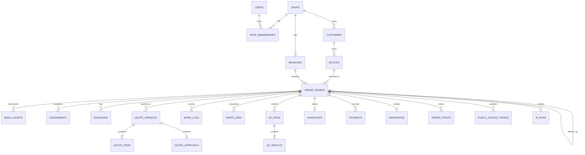
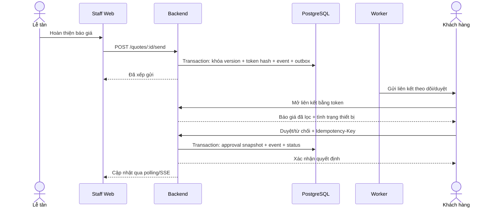
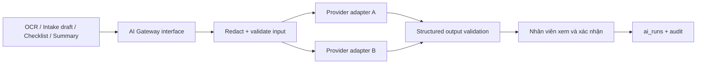
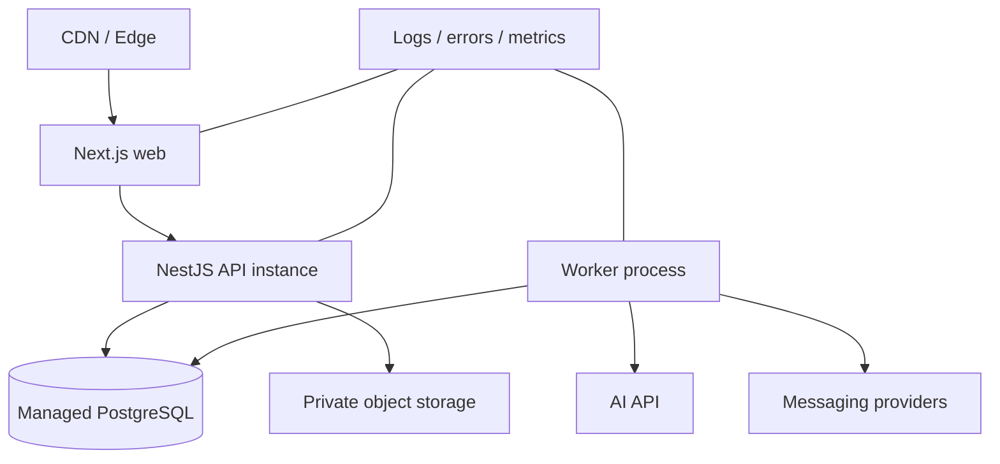

# RepairFlow — Kiến trúc hệ thống v1.0

## 1. Quyết định sản phẩm

**RepairFlow** là SaaS quản lý toàn bộ vòng đời một ca sửa điện thoại, laptop hoặc tablet cho cửa hàng sửa chữa quy mô nhỏ và vừa.

Luồng cốt lõi:

```text
Tiếp nhận + chụp tình trạng
→ kiểm tra và chẩn đoán
→ lập báo giá có phiên bản
→ khách duyệt qua liên kết
→ sửa chữa và ghi nhật ký
→ kiểm tra chất lượng
→ bàn giao
→ bảo hành
```

Ba quyết định quan trọng:

1. Xây theo **modular monolith**, chưa dùng microservice.
2. Nhân viên dùng web responsive/PWA; khách hàng xem và duyệt báo giá qua liên kết bảo mật, không cần tạo tài khoản.
3. AI là lớp hỗ trợ. Quy trình quản lý vẫn chạy đầy đủ khi nhà cung cấp AI lỗi hoặc bị tắt.

### Phạm vi MVP

- Một doanh nghiệp có một hoặc nhiều chi nhánh.
- Vai trò: chủ cửa hàng, lễ tân, kỹ thuật viên.
- Quản lý khách hàng, thiết bị, phiếu sửa, ảnh tiếp nhận, phân công, chẩn đoán, báo giá, phê duyệt, nhật ký sửa, QC, bàn giao và bảo hành.
- Ghi nhận thanh toán cơ bản; chưa làm kế toán hoặc cổng thanh toán.
- Theo dõi linh kiện đã dùng; chưa làm quản trị tồn kho đầy đủ.

### Chưa làm trong MVP

- Marketplace kết nối khách với nhiều cửa hàng.
- Ứng dụng mobile native.
- Chatbot tự chẩn đoán và cam kết lỗi.
- Tự quyết định giá hoặc tự duyệt thay con người.
- Quản lý kế toán, thuế, lương và chuỗi cung ứng.

## 2. Người dùng và quyền

| Vai trò | Quyền chính |
|---|---|
| Chủ cửa hàng | Toàn bộ dữ liệu cửa hàng, nhân viên, cấu hình, báo cáo, mọi phiếu sửa |
| Lễ tân | Tiếp nhận, cập nhật khách/thiết bị, tạo báo giá, gửi liên kết, thu tiền, bàn giao |
| Kỹ thuật viên | Xem phiếu được phân công, chẩn đoán, ghi công việc/linh kiện, cập nhật trạng thái, thực hiện QC |
| Khách hàng | Qua token giới hạn: xem đúng phiếu của mình, duyệt/từ chối đúng phiên bản báo giá, xem tiến độ |

Quyền luôn được kiểm tra ở backend. Giao diện ẩn nút chỉ nhằm cải thiện trải nghiệm, không được xem là cơ chế bảo mật.

## 3. Kiến trúc tổng thể



### Stack đề xuất

| Thành phần | Công nghệ | Lý do |
|---|---|---|
| Frontend | Next.js, TypeScript, Tailwind CSS, component library | Responsive tốt, làm dashboard và public portal trong cùng dự án |
| Backend | NestJS, TypeScript, REST + OpenAPI | Module, guard và validation rõ; phù hợp trình bày kiến trúc |
| Database | PostgreSQL + Prisma | Quan hệ nghiệp vụ chặt, transaction tốt, migration dễ quản lý |
| File | Object storage tương thích S3 | Ảnh thiết bị không làm phình database; hỗ trợ signed URL |
| Job nền | PostgreSQL job/outbox ở MVP | Bớt một hạ tầng Redis; vẫn gửi thông báo và chạy AI ngoài request chính |
| Auth | Dịch vụ auth quản lý sẵn hoặc JWT/refresh token do backend quản lý | Giảm rủi ro tự làm sai xác thực; backend vẫn sở hữu RBAC và tenant isolation |
| Quan sát | Structured logs + error tracking + request ID | Lần được một thao tác từ API đến job/AI |

Redis/BullMQ chỉ nên thêm khi lượng job lớn hoặc cần retry/throughput cao. Microservice chưa có lợi ở giai đoạn đầu.

## 4. Các module backend

| Module | Trách nhiệm | Không được làm thay module khác |
|---|---|---|
| Identity & Tenant | User, cửa hàng, chi nhánh, membership, role | Không chứa logic phiếu sửa |
| Customer & Device | Hồ sơ khách, thiết bị, serial/IMEI, lịch sử thiết bị | Không quyết định trạng thái sửa |
| Repair Order | Phiếu tiếp nhận, phụ kiện, mô tả lỗi, phân công, state machine | Không gọi trực tiếp nhà cung cấp AI |
| Diagnosis & Quote | Chẩn đoán, phiên bản báo giá, từng hạng mục và phê duyệt | Không sửa bản báo giá đã gửi |
| Service Execution | Work log, linh kiện đã dùng, checklist QC | Không thay đổi báo giá đã được duyệt |
| Handover & Warranty | Bàn giao, thanh toán cơ bản, điều khoản bảo hành, ca bảo hành | Không làm sổ cái kế toán |
| Customer Portal | Đọc dữ liệu đã lọc, duyệt/từ chối báo giá bằng token | Không trả ghi chú nội bộ hoặc bí mật thiết bị |
| Media | Upload bằng signed URL, metadata, quyền truy cập | Không lưu binary trong PostgreSQL |
| Notification | Template và adapter Zalo/SMS/email, retry | Không chứa logic chuyển trạng thái nghiệp vụ |
| AI Assistance | OCR, chuyển giọng nói thành phiếu, gợi ý checklist, tóm tắt | Không tự chẩn đoán, ra giá hay đổi trạng thái |
| Audit & Timeline | Sự kiện bất biến phục vụ truy vết và trang tiến độ | Không cho phép sửa/xóa sự kiện qua API thường |

Mọi module giao tiếp qua service interface và domain event nội bộ. Không để controller gọi thẳng repository của module khác.

## 5. State machine của phiếu sửa



Backend chỉ cho phép chuyển theo bảng trạng thái. Mỗi lần chuyển phải tạo `order_event` trong cùng transaction. Không cho frontend gửi tùy ý một chuỗi `status` và ghi thẳng vào database.

`READY_FOR_PICKUP` bắt buộc có `completion_outcome`: `REPAIRED`, `DECLINED_QUOTE`, `UNREPAIRABLE`, `NO_FAULT_FOUND` hoặc `CUSTOMER_CANCELLED`. Nhờ vậy “không sửa” và “đã trả thiết bị” là hai sự kiện khác nhau. Bảo hành không mở lại phiếu `COMPLETED`; hệ thống tạo phiếu mới có `source_order_id` trỏ về phiếu ban đầu.

Báo giá có state machine riêng:

```text
DRAFT → SENT → ACCEPTED / PARTIALLY_ACCEPTED / DECLINED
             ↘ EXPIRED
             ↘ SUPERSEDED
```

### Quy tắc bắt buộc

- Chỉ gửi báo giá khi có ít nhất một hạng mục và tổng tiền được tính ở server.
- Báo giá đã gửi là snapshot bất biến. Muốn sửa phải tạo phiên bản mới.
- Phê duyệt luôn trỏ đến đúng `quote_version_id`; gửi báo giá mới sẽ vô hiệu hóa liên kết duyệt phiên bản cũ.
- Không thể bắt đầu sửa nếu chưa có phê duyệt hợp lệ, trừ trường hợp miễn phí được đánh dấu và audit rõ.
- Không thể chuyển sang `READY_FOR_PICKUP` nếu checklist QC bắt buộc chưa đạt.
- Chỉ chủ cửa hàng hoặc lễ tân được xác nhận bàn giao và thanh toán.
- Một phiếu đã `COMPLETED` không được mở lại; ca bảo hành tạo phiếu mới liên kết phiếu ban đầu và điều khoản tại thời điểm bàn giao.

## 6. Mô hình dữ liệu

Tất cả bảng dữ liệu nghiệp vụ có `shop_id`. Với doanh nghiệp nhiều chi nhánh, các bản ghi vận hành còn có `branch_id`.



### Bảng cốt lõi và trường quan trọng

| Bảng | Trường đáng chú ý |
|---|---|
| `shops` | `id`, `name`, `timezone`, `settings_json` |
| `branches` | `id`, `shop_id`, `name`, `address` |
| `shop_memberships` | `shop_id`, `user_id`, `role`, `status` |
| `customers` | `shop_id`, `name`, `phone_normalized`, `email`, `consent_at` |
| `devices` | `shop_id`, `customer_id`, `type`, `brand`, `model`, `serial`, `imei_masked` |
| `repair_orders` | `code`, `shop_id`, `branch_id`, `device_id`, `status`, `completion_outcome`, `reported_issue`, `priority`, `source_order_id`, `customer_snapshot`, `device_snapshot`, `version` |
| `intake_accessories` | `repair_order_id`, `name`, `condition_note` |
| `media_assets` | `repair_order_id`, `object_key`, `purpose`, `mime_type`, `created_by` |
| `assignments` | `repair_order_id`, `technician_id`, `assigned_at`, `unassigned_at` |
| `diagnoses` | `repair_order_id`, `finding`, `recommendation`, `created_by` |
| `quote_versions` | `repair_order_id`, `version_no`, `status`, `subtotal`, `discount`, `total`, `sent_at`, `expires_at` |
| `quote_items` | `quote_version_id`, `kind`, `description`, `qty`, `unit_price`, `line_total`, `is_optional` |
| `quote_approvals` | `quote_version_id`, `decision`, `approved_item_snapshot`, `decided_at`, `actor_fingerprint` |
| `work_logs` | `repair_order_id`, `technician_id`, `action`, `note`, `started_at`, `ended_at` |
| `parts_used` | `repair_order_id`, `name`, `sku`, `qty`, `cost`, `sale_price` |
| `qc_runs/results` | template/version, người kiểm tra, từng mục đạt/không đạt, ghi chú |
| `handovers` | `repair_order_id`, `recipient_name`, `handed_over_by`, `handed_over_at`, `signature_asset_id` |
| `payments` | `repair_order_id`, `amount`, `method`, `reference`, `received_at` |
| `warranties` | `repair_order_id`, `starts_at`, `ends_at`, `terms_snapshot` |
| `order_events` | `repair_order_id`, `type`, `actor_type`, `actor_id`, `public_payload`, `private_payload`, `created_at` |
| `public_access_tokens` | `repair_order_id`, `token_hash`, `scope`, `expires_at`, `revoked_at`, `last_used_at` |
| `ai_runs` | `repair_order_id`, `capability`, `provider`, `model`, `input_ref`, `output_json`, `confidence`, `accepted_by`, `created_at` |
| `audit_logs` | `shop_id`, `actor_id`, `action`, `entity_type`, `entity_id`, `before_json`, `after_json`, `request_id` |

Các số tiền dùng integer theo đơn vị đồng, không dùng floating point. Mã phiếu hiển thị như `HCM-2609-00124` có unique constraint theo cửa hàng. Dùng optimistic locking qua trường `version` để tránh hai nhân viên ghi đè nhau.

## 7. API chính

Prefix nội bộ: `/api/v1`. API khách hàng tách prefix `/public/v1` và chỉ dùng token có scope.

| Method + path | Mục đích |
|---|---|
| `POST /repair-orders` | Tạo phiếu tiếp nhận |
| `GET /repair-orders` | Lọc theo trạng thái, kỹ thuật viên, chi nhánh, từ khóa |
| `GET /repair-orders/:id` | Chi tiết cùng timeline |
| `POST /repair-orders/:id/transition` | Chuyển trạng thái qua command đã kiểm tra |
| `POST /repair-orders/:id/assignments` | Phân công kỹ thuật viên |
| `POST /repair-orders/:id/media/presign` | Lấy signed URL để tải ảnh lên |
| `POST /repair-orders/:id/diagnoses` | Ghi chẩn đoán |
| `POST /repair-orders/:id/quotes` | Tạo phiên bản báo giá nháp |
| `POST /quotes/:id/send` | Khóa snapshot, tạo token và xếp job thông báo |
| `POST /repair-orders/:id/work-logs` | Ghi công việc kỹ thuật |
| `POST /repair-orders/:id/qc-runs` | Nộp checklist QC |
| `POST /repair-orders/:id/handovers` | Bàn giao và tạo bảo hành |
| `GET /public/v1/orders/:token` | Dữ liệu đã lọc cho khách |
| `POST /public/v1/quotes/:token/decision` | Duyệt hoặc từ chối đúng phiên bản báo giá |
| `POST /ai/v1/device-ocr` | OCR thông tin thiết bị; trả job ID |
| `POST /ai/v1/intake-draft` | Chuyển audio/text thành bản nháp tiếp nhận |
| `POST /ai/v1/checklist-suggestion` | Gợi ý checklist để kỹ thuật viên chọn |
| `POST /ai/v1/customer-summary` | Viết lại ghi chú thành cập nhật dễ hiểu |

Các lệnh tạo báo giá, phê duyệt và bàn giao nhận `Idempotency-Key`. API dùng DTO validation, pagination theo cursor cho timeline và error code ổn định để frontend xử lý.

## 8. Luồng duyệt báo giá



SSE có thể thêm sau. MVP chỉ cần refetch/polling sau 15–30 giây trên bảng công việc.

## 9. Kiến trúc AI



Mỗi năng lực có schema đầu ra riêng. Ví dụ OCR trả `{brand, model, serial, imei, confidence}`; backend kiểm tra định dạng và nhân viên phải xác nhận trước khi ghi vào hồ sơ thiết bị.

Nguyên tắc:

- Không gửi tên, số điện thoại, mật khẩu mở khóa hoặc ảnh không cần thiết cho model.
- Prompt và provider nằm sau `AI Gateway`; nghiệp vụ không import SDK model trực tiếp.
- Có timeout, retry hữu hạn, cost limit theo cửa hàng và circuit breaker.
- Lưu provider/model/prompt version, confidence và việc người dùng chấp nhận hay sửa kết quả.
- Nếu AI lỗi, trả trạng thái thất bại rõ và cho nhân viên nhập tay; không chặn phiếu sửa.
- Gợi ý AI luôn được gắn nhãn “bản nháp”, không hiển thị như kết luận kỹ thuật.

## 10. Bảo mật và riêng tư

1. **Tenant isolation:** lấy `shop_id` từ membership trong access token/session, không nhận `shop_id` tùy ý từ request body. Repository luôn bắt buộc tenant context; test chéo tenant là test bảo mật bắt buộc.
2. **Public token:** tạo token entropy cao, chỉ lưu hash, có scope (`track`, `approve_quote`), hạn dùng và khả năng revoke. Không đưa database ID tuần tự vào URL.
3. **Ảnh thiết bị:** bucket private; upload/download qua signed URL ngắn hạn. Xóa metadata vị trí nếu không cần.
4. **Mật khẩu mở máy:** không lưu trong trường ghi chú. Tốt nhất không lưu ở MVP. Nếu nghiệp vụ bắt buộc, dùng kho bí mật mã hóa riêng, giới hạn người xem, audit mỗi lần mở và tự xóa khi bàn giao.
5. **Dữ liệu gửi AI:** lọc PII, giới hạn mục đích và không dùng dữ liệu khách để huấn luyện nếu nhà cung cấp cho phép cấu hình.
6. **Báo giá/phê duyệt:** lưu snapshot, thời gian, phiên bản và bằng chứng quyết định; không cho sửa lịch sử.
7. **Vận hành:** HTTPS, secure cookie, CSRF protection nếu dùng cookie auth, rate limit public API, backup tự động, restore drill và secrets ngoài source code.

## 11. Transaction, event và job nền

Các thao tác quan trọng dùng transaction PostgreSQL:

- tạo phiếu + mã phiếu + event tiếp nhận;
- gửi báo giá + khóa snapshot + public token + outbox event;
- khách phê duyệt + approval snapshot + chuyển trạng thái;
- bàn giao + thanh toán + bảo hành + xóa bí mật mở máy.

Dùng transactional outbox để tránh tình trạng database đã cập nhật nhưng tin nhắn không được gửi. Worker đọc outbox, xử lý idempotent, retry theo exponential backoff và đưa job lỗi nhiều lần vào dead-letter state để chủ cửa hàng thấy trên màn hình.

Các event nội bộ ban đầu:

- `repair_order.received`
- `repair_order.assigned`
- `quote.sent`
- `quote.decided`
- `repair_order.status_changed`
- `qc.completed`
- `repair_order.ready_for_pickup`
- `repair_order.completed`
- `warranty_case.opened`

## 12. Triển khai



MVP có bốn deployable: `web`, `api`, `worker`, PostgreSQL; object storage là dịch vụ quản lý sẵn. API và worker dùng cùng code domain/package nhưng chạy process riêng. Khi tải tăng, scale API và worker độc lập mà không đổi mô hình nghiệp vụ.

### Cấu trúc monorepo

```text
repairflow/
├─ apps/
│  ├─ web/                 # staff dashboard + public customer portal
│  ├─ api/                 # NestJS modular monolith
│  └─ worker/              # outbox, notifications, AI jobs
├─ packages/
│  ├─ contracts/           # DTO/schema dùng chung, generated API client
│  ├─ ui/                  # component dùng chung
│  ├─ config/              # eslint/tsconfig/env schema
│  └─ observability/       # logger, request/job correlation
├─ prisma/
│  ├─ schema.prisma
│  ├─ migrations/
│  └─ seed.ts
├─ docs/
│  ├─ architecture.md
│  ├─ api.openapi.yaml
│  └─ decisions/           # ADR: modular monolith, tenant model, public token
└─ docker-compose.yml      # local database + object storage emulator
```

Trong `apps/api`, module theo domain (`identity`, `customers`, `devices`, `repair-orders`, `quotes`, `service`, `warranty`, `media`, `notifications`, `ai`, `audit`) thay vì chia cả hệ thống thành thư mục controller/service/repository chung.

## 13. Chỉ mục và tính toàn vẹn dữ liệu

Các constraint/index cần có sớm:

- unique `(shop_id, code)` trên phiếu sửa;
- index không unique `(shop_id, imei_normalized)` và `(shop_id, serial_normalized)`; dữ liệu thực tế có thể thiếu, nhập sai hoặc trùng;
- index `(shop_id, branch_id, status, updated_at desc)` cho bảng công việc;
- index `(shop_id, customer_id)` và phone normalized cho tìm khách;
- unique `(repair_order_id, version_no)` cho báo giá;
- chỉ một quote version ở trạng thái `SENT` cho mỗi phiếu;
- chỉ một quyết định cuối cùng cho một quote version;
- check `qty > 0`, `unit_price >= 0`, `amount > 0`;
- foreign key và soft delete có kiểm soát; không cascade xóa lịch sử phiếu sửa.

## 14. Kiểm thử cần thiết

Không cần phủ test mọi dòng. Tập trung vào rủi ro nghiệp vụ:

- state machine và role permission;
- user shop A không đọc/sửa được dữ liệu shop B;
- báo giá đã gửi không thể sửa;
- token cũ không duyệt được báo giá mới;
- request duyệt lặp lại không tạo hai approval;
- tổng tiền do server tính đúng;
- QC không đạt không thể chuyển sang chờ nhận máy;
- transaction/outbox không làm mất thông báo;
- AI output sai schema không được ghi thẳng vào dữ liệu chính.

## 15. Lộ trình triển khai

### Giai đoạn 1 — Vertical slice có thể demo

1. Auth, shop, membership và RBAC.
2. Khách hàng, thiết bị, phiếu tiếp nhận và ảnh.
3. Dashboard trạng thái và phân công.
4. Chẩn đoán, báo giá phiên bản, public link và khách duyệt.
5. Work log, QC, bàn giao và bảo hành.
6. Timeline/audit, seed demo và triển khai staging.

Đây là MVP có thể bán thử ngay cả khi chưa có AI.

### Giai đoạn 2 — AI có giá trị đo được

1. OCR serial/IMEI từ ảnh.
2. Ghi âm tiếp nhận thành bản nháp có cấu trúc.
3. Tóm tắt ghi chú kỹ thuật cho khách hàng.
4. Gợi ý checklist từ loại thiết bị và mô tả lỗi.

Theo dõi tỷ lệ nhân viên chấp nhận/sửa kết quả và số phút tiết kiệm trên mỗi phiếu. Nếu không cải thiện hai chỉ số này, không mở rộng AI.

### Giai đoạn 3 — Sau khi có cửa hàng dùng thật

- Tồn kho linh kiện và nhà cung cấp.
- Nhiều chi nhánh, chuyển phiếu/linh kiện.
- Báo cáo lợi nhuận theo ca sửa và kỹ thuật viên.
- Zalo OA chính thức, webhook trạng thái gửi.
- API tích hợp POS/kế toán.
- Repair passport/QR lịch sử bảo hành với quyền riêng tư rõ ràng.

## 16. Tiêu chí MVP hoàn thành

MVP được xem là hoàn thành khi một cửa hàng thật có thể thực hiện trọn vẹn các bước sau mà không dùng bảng tính phụ:

1. Nhận máy và lưu bằng chứng tình trạng.
2. Phân công kỹ thuật viên.
3. Tạo và gửi báo giá.
4. Khách duyệt trên điện thoại mà không đăng nhập.
5. Kỹ thuật viên ghi quá trình sửa và hoàn thành QC.
6. Lễ tân bàn giao, ghi tiền và tạo bảo hành.
7. Chủ cửa hàng tra lại toàn bộ lịch sử ai làm gì và lúc nào.

Điểm trình bày mạnh nhất của RepairFlow không phải số lượng màn hình. Đó là một workflow có kiểm soát, dữ liệu bất biến ở các mốc quan trọng, trải nghiệm khách hàng không cần cài ứng dụng, và AI được đặt đúng chỗ để giảm thao tác mà không thay con người ra quyết định.
