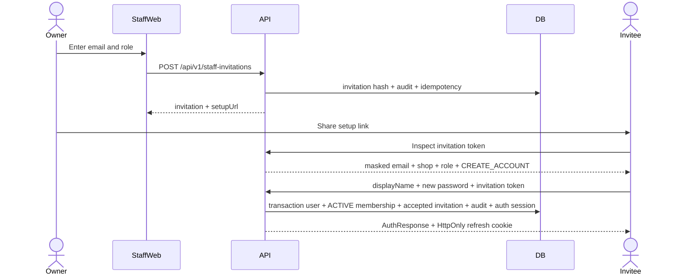
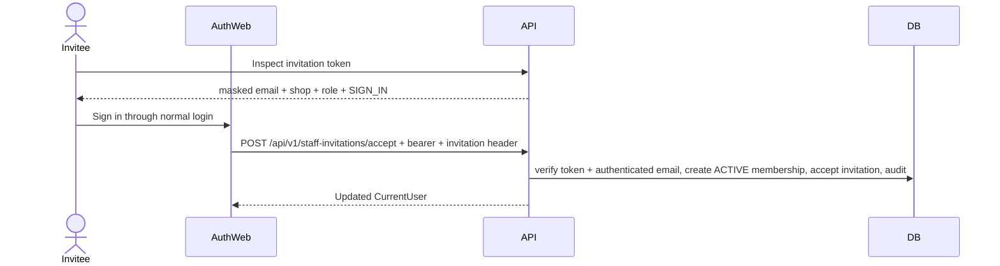

# RF-039 — Staff membership management

## Objective

Complete the missing staff-onboarding boundary so a newly registered RepairFlow shop can add receptionists and technicians, assign a technician, and execute the core repair journey without direct database changes.

The owner creates a secure setup invitation. Accepting that invitation either creates a new global user or adds the selected shop membership to an existing user. The owner can then manage the member's shop-specific role and active state while tenant isolation, existing sessions in other shops, and the last active owner remain protected.

## Business outcome

After RF-039:

1. An owner can copy a one-time setup link for a receptionist or technician.
2. A new staff member can set their own password and enter the invited shop.
3. A user who already has a RepairFlow account can sign in and accept another shop membership without creating a second identity.
4. Owner and receptionist can view the shop's current staff according to RBAC; only owner can mutate staff.
5. Owner can promote an active receptionist/technician to owner, change receptionist/technician role, activate, or deactivate a membership.
6. Deactivation immediately removes tenant access while preserving assignments, repair history, audit history, and access to any other shops where the user remains active.
7. The system cannot demote or deactivate the last active owner, including under concurrent requests.

## Source-of-truth gaps and decisions

### Existing gaps

- `docs/product-spec.md` includes memberships and says the owner manages staff, but no complete onboarding flow exists.
- `docs/rbac.md` allows owner to invite/deactivate staff and allows owner/receptionist to view memberships.
- `docs/screen-specs.md` currently describes S10 as owner-only. RF-039 resolves this conflict in favor of the higher-precedence RBAC source: owner has management controls; receptionist receives a read-only membership list; technician has no staff-settings access.
- `docs/openapi.yaml` has registration/login/session contracts but no staff list, invitation acceptance, or membership mutation contract.
- `ShopMembership` already has `INVITED`, `ACTIVE`, and `INACTIVE`, but there is no secure invitation credential, expiry, revocation, concurrency version, or acceptance record.
- A newly registered shop contains only its owner. Because `RECEIVED -> DIAGNOSING` requires an active assigned technician, the documented core journey cannot currently be completed without a database fixture.

### Frozen decisions

- A `User` is a global identity. A `ShopMembership` is the only source of role and access inside one shop.
- Email is normalized with the existing identity rule: trim then locale-independent lowercase. RF-039 must not create a second user for a normalized email that already exists.
- An owner never chooses, receives, stores, or resets a staff password. “Create staff” means creating a secure setup invitation which creates the user on acceptance when needed.
- RF-039 supports manual `COPY_LINK` onboarding. Real email/SMS/Zalo delivery remains Milestone 6 scope. The owner sees the setup URL only in the successful create/reissue response or a valid idempotent replay.
- New-email acceptance creates the user, activates the membership, creates the first refresh session, and returns the existing `AuthResponse` contract.
- Existing-email acceptance requires a valid access token whose normalized user email matches the invitation. It adds the membership and returns an updated `CurrentUser`; it never asks for or verifies a password inside the invitation endpoint.
- A pending invitation is separate from `ShopMembership`. Membership is created only when the invitation is accepted. This avoids dangling `INVITED` memberships for users who never join. Existing legacy `INVITED` memberships remain readable but RF-039 does not create new ones.
- Invitations may initially target only `RECEPTIONIST` or `TECHNICIAN`. An active member may later be promoted to `OWNER` through the membership update command.
- Membership mutation may set role to `OWNER`, `RECEPTIONIST`, or `TECHNICIAN`, and status to `ACTIVE` or `INACTIVE`. Clients cannot set `INVITED`.
- Demoting or deactivating an owner is allowed only when another active owner remains after the transaction.
- Deactivating a technician does not delete or rewrite assignments. The technician immediately loses tenant access; owner/receptionist must reassign any active orders. Historical assignment references remain intact.
- Deactivation does not revoke the user's global refresh sessions because those sessions may serve other shops. `TenantGuard` must reject the inactive shop on every subsequent request.
- Invitation tokens are purpose-specific and are not `PublicAccessToken` rows. They use a separate persistence aggregate and cryptographic domain separation.

## Scope

- Freeze domain, RBAC, OpenAPI, error, screen, and persistence contracts for staff membership management.
- Add owner-only invitation create, reissue, and revoke operations.
- Add owner/receptionist membership listing with owner-only mutation controls.
- Add public safe invitation inspection and new-account acceptance.
- Add authenticated existing-account acceptance without requiring an active membership in the destination shop.
- Add optimistic concurrency, last-owner protection, audit records, rate limits, and tenant isolation.
- Add staff settings UI and invitation acceptance UI with desktop and 360 px behavior.
- Add tests proving that a fresh owner can onboard a technician without a database fixture.

## Outside scope

- Real email, SMS, or Zalo delivery and delivery retry/dead-letter handling.
- Password reset, forgotten-password email, MFA, SSO, or social login.
- Owner-supplied temporary passwords or displaying any password to an owner.
- Branch-scoped staff permissions or staff schedules.
- Hard-deleting users, memberships, assignments, audit logs, or repair history.
- Editing global user email, display name, or `User.status` from shop settings.
- Bulk import, payroll, attendance, technician performance reports, or custom roles.
- Modifying repair-order state rules, quote/work/QC/handover contracts, or public customer tokens.

## Roles and capabilities

Add explicit capabilities rather than relying on the owner's current catch-all set:

| Capability | Owner | Receptionist | Technician | Notes |
|---|:---:|:---:|:---:|---|
| `STAFF_MEMBERSHIP_READ` | A | A | — | Active membership in selected shop required. |
| `STAFF_MEMBERSHIP_MANAGE` | A | — | — | Invite, reissue, revoke, role and status changes. |

Rules:

- Staff list and management endpoints use bearer authentication and validated `X-Shop-Id` tenant context.
- Public invitation inspection/new-user acceptance has no staff tenant context; the invitation token binds the target shop and email.
- Existing-user acceptance uses bearer authentication but deliberately does not use `TenantGuard`, because the user does not have an active destination membership yet. The application service obtains the shop only from the verified invitation and requires the authenticated user's normalized email to match it.
- UI visibility is not authorization. A receptionist receives `403 PERMISSION_DENIED` for every mutation even if a request is crafted manually.
- A cross-tenant invitation ID or membership user ID behaves as `404 RESOURCE_NOT_FOUND`.

## Authentication and invitation flow

### Token lifecycle

- Generate the raw setup token with a keyed HMAC/PRF using `PUBLIC_TOKEN_SECRET` and a distinct context such as `staff-invitation:v1:{invitationId}`. The context must prevent interchange with quote or tracking tokens.
- Persist only a SHA-256 token hash. Never persist the raw token or setup URL.
- Default expiry is 72 hours and is server-owned.
- The token is bound to exactly one invitation, shop, normalized email, and invited role.
- `ACCEPTED`, `REVOKED`, `SUPERSEDED`, and `EXPIRED` are terminal invitation states.
- Reissue creates a new invitation row and token and marks the prior pending invitation `SUPERSEDED` in the same transaction.
- Creating a new invitation for the same `(shopId, normalizedEmail)` first marks an expired pending invitation `EXPIRED`; a non-expired pending invitation returns `STAFF_INVITATION_ALREADY_PENDING`.
- The same idempotency key and payload returns the same invitation and re-derives the same setup URL before expiry. The idempotency record must not contain the raw token or URL. The same key with another payload returns `IDEMPOTENCY_KEY_REUSED`.
- A used, revoked, superseded, malformed, or unknown token never grants access. Expired links return a terminal expiry response and never mint a replacement.

### New user



New-user acceptance:

1. Applies the same password contract and `PasswordHasherService` used by owner registration.
2. Re-checks normalized email uniqueness inside the transaction.
3. Creates one global active user and one active membership with `joinedAt=serverNow`.
4. Marks the invitation accepted by the created user and appends a redacted audit record.
5. Issues access/refresh credentials through the existing identity/session boundary.
6. If a user with that email appears concurrently, no second identity is created. The API returns `STAFF_INVITATION_SIGN_IN_REQUIRED`; the invitee signs in and uses the existing-user flow.

### Existing user



- A different authenticated email receives `STAFF_INVITATION_RECIPIENT_MISMATCH` and no membership is created.
- An existing active/inactive membership is never overwritten by acceptance. The API returns `STAFF_MEMBERSHIP_ALREADY_EXISTS`; owner must use membership management for an inactive record.
- Acceptance is exactly-once through the locked single-use invitation and unique membership constraint. It does not use `Idempotency-Key`, because an `AuthResponse` contains credentials that must never be persisted for replay. If a new-user response is lost after commit, the invitee signs in normally with the password they just set. If an existing-user response is lost, the client refreshes `/me`; neither recovery creates another membership or session.

## HTTP contract

All staff endpoints below are under the existing `/api/v1` prefix and use the normal bearer token. Except for authenticated invitation acceptance, they require validated `X-Shop-Id`.

### Membership list

`GET /api/v1/staff-memberships`

Query:

- `query`: optional display-name/email search, max 100.
- `role`: optional `OWNER|RECEPTIONIST|TECHNICIAN`.
- `status`: optional `INVITED|ACTIVE|INACTIVE`; `INVITED` supports legacy records only.
- `cursor`: optional opaque cursor ordered by `(updatedAt desc, userId desc)`.

Response item:

```json
{
  "userId": "uuid",
  "displayName": "Nguyen Van A",
  "email": "staff@example.com",
  "role": "TECHNICIAN",
  "status": "ACTIVE",
  "invitedAt": "ISO-8601",
  "joinedAt": "ISO-8601 or null",
  "updatedAt": "ISO-8601",
  "lockVersion": 0,
  "isCurrentUser": false
}
```

The response uses the standard `{data, meta: {nextCursor}}` page envelope. It contains no password/session data, other-shop memberships, assignment details, or global security metadata.

### Pending invitation list

`GET /api/v1/staff-invitations?status=PENDING|EXPIRED|REVOKED|SUPERSEDED|ACCEPTED&cursor=...`

- Owner only.
- Returns invitation metadata and derived status. It never returns a token or setup URL.
- Response fields: `id`, `email`, `role`, `status`, `expiresAt`, `acceptedAt`, `revokedAt`, `supersededAt`, `createdAt`, `updatedAt`, and `lockVersion`.

### Create invitation

`POST /api/v1/staff-invitations`

Headers: `X-Shop-Id`, `Idempotency-Key`.

```json
{
  "email": "technician@example.com",
  "role": "TECHNICIAN"
}
```

- `role` accepts only `RECEPTIONIST|TECHNICIAN`.
- Returns `201` with `{data: {invitation, setupUrl}}`.
- `setupUrl` uses `PUBLIC_WEB_URL` and the web route `/join/{rawToken}`.
- Active/inactive membership in the same shop returns `STAFF_MEMBERSHIP_ALREADY_EXISTS` without disclosing memberships in another shop.
- A pending invite in another shop does not conflict.

### Reissue invitation

`POST /api/v1/staff-invitations/{invitationId}/reissue`

Headers: `X-Shop-Id`, `Idempotency-Key`.

```json
{"expectedLockVersion": 0}
```

- Only a pending or expired same-tenant invitation may be reissued.
- Atomically marks the old row `SUPERSEDED`, creates a new pending row, appends audit, and returns the new `setupUrl`.
- The old token immediately becomes invalid.

### Revoke invitation

`POST /api/v1/staff-invitations/{invitationId}/revoke`

Headers: `X-Shop-Id`, `Idempotency-Key`.

```json
{"expectedLockVersion": 0}
```

- Only a pending same-tenant invitation may be revoked.
- Revoke is immutable and makes the token unusable.
- Returns the invitation metadata without a token.

### Update membership

`PATCH /api/v1/staff-memberships/{userId}`

Headers: `X-Shop-Id`, `Idempotency-Key`.

```json
{
  "role": "TECHNICIAN",
  "status": "ACTIVE",
  "expectedLockVersion": 2
}
```

- At least one of `role` or `status` is required.
- Role accepts `OWNER|RECEPTIONIST|TECHNICIAN`; status accepts `ACTIVE|INACTIVE` only.
- Server increments `lockVersion` exactly once on an effective update.
- Same-value input is a successful idempotent no-op and does not invent audit history.
- The command locks the target membership and protects the active-owner count in one transaction.
- Last-owner failure returns `LAST_OWNER_REQUIRED` and changes nothing.

### Public invitation inspection

`GET /public/v1/staff-invitation`

Header: `X-RepairFlow-Invitation-Token`.

Response:

```json
{
  "data": {
    "shopName": "RepairFlow Demo",
    "emailMasked": "te***@example.com",
    "role": "TECHNICIAN",
    "expiresAt": "ISO-8601",
    "acceptanceMode": "CREATE_ACCOUNT"
  }
}
```

- `acceptanceMode` is `CREATE_ACCOUNT` or `SIGN_IN`.
- It contains no shop ID, user ID, invitation ID, full email, membership list, or token.
- Invalid/revoked/superseded tokens return the same generic invalid-link response.

### New-user acceptance

`POST /public/v1/staff-invitation/accept`

Header: `X-RepairFlow-Invitation-Token`.

```json
{
  "displayName": "Nguyen Van A",
  "password": "at-least-10-characters"
}
```

- Valid only for `CREATE_ACCOUNT` mode.
- Returns the existing `AuthResponse` and sets the existing HttpOnly refresh cookie.
- Applies register and token-scoped rate limits.

### Existing-user acceptance

`POST /api/v1/staff-invitations/accept`

Headers: bearer token and `X-RepairFlow-Invitation-Token`. No `X-Shop-Id` is accepted or trusted.

- Valid only for `SIGN_IN` mode and matching authenticated normalized email.
- Returns `{data: CurrentUser}` with the new active membership.
- It does not rotate the current refresh family or grant access when the global user is disabled.

## Membership rules

1. A membership is unique by `(shopId, userId)` and role is scoped to that row.
2. Only active membership grants tenant context. `INVITED` and `INACTIVE` receive `MEMBERSHIP_INACTIVE` for that shop.
3. At least one active owner must remain after every role/status change.
4. Owner protection is enforced under concurrency by locking the shop or active-owner set before counting and updating.
5. Changing a role or status appends one audit record with the actor, request ID, target user ID, and role/status before/after.
6. No staff action changes `User.status`, email, password, display name, sessions, or memberships in another shop.
7. Deactivation is an access-control operation, not a deletion. It preserves `joinedAt`, assignments, diagnoses, work, QC, payments, handovers, and audit records.
8. Reactivation preserves the original `joinedAt`. An accepted invitation sets `joinedAt` only once.
9. A technician who becomes inactive disappears from assignable-technician results immediately. Existing assignment history remains visible and must be reassigned before guarded work continues.
10. Promoting a member to owner grants owner capabilities on the next request because permission is resolved from current membership, not embedded role claims in the access token.

## Transaction and concurrency boundaries

### Create/reissue/revoke invitation

One transaction must:

1. Validate actor's active owner membership.
2. Normalize email and serialize the `(shopId, normalizedEmail)` invitation slot.
3. Re-read same-shop membership and pending invitation state.
4. Create/supersede/revoke invitation metadata and token hash.
5. Append redacted `AuditLog`.
6. Persist the idempotency result without raw token or setup URL.
7. Commit, then derive the URL in memory for the response.

### Accept invitation

One transaction must:

1. Hash and lock the invitation selected by the raw token.
2. Re-check state, expiry, shop, normalized email, and acceptance mode.
3. Create or verify the global user according to the selected flow.
4. Reject an existing membership without overwriting it.
5. Create one active membership and mark invitation accepted.
6. Append redacted audit data. Single-use token state and the membership uniqueness constraint provide exactly-once acceptance without persisting credentials in an idempotency response.
7. For new users, create the refresh session in the same transaction.

Any acceptance failure rolls back user, membership, invitation state, session, and audit together.

### Change membership

One transaction must lock the target membership and last-owner decision boundary, re-read current role/status, apply optimistic `expectedLockVersion`, enforce the last-owner rule, update once, append audit, and persist idempotency. Two concurrent attempts to remove the final owners cannot both succeed.

## Persistence changes

Add:

```text
enum StaffInvitationStatus {
  PENDING
  ACCEPTED
  REVOKED
  SUPERSEDED
  EXPIRED
}

StaffInvitation
  id                 UUID primary key
  shopId             UUID tenant foreign key
  email              normalized email
  role               RECEPTIONIST | TECHNICIAN
  status             StaffInvitationStatus
  tokenHash          unique SHA-256 hash
  expiresAt          timestamptz
  acceptedAt         timestamptz nullable
  acceptedByUserId   UUID nullable
  revokedAt          timestamptz nullable
  revokedByUserId    UUID nullable
  supersededAt       timestamptz nullable
  createdByUserId    UUID
  lockVersion        integer default 0
  createdAt          timestamptz
  updatedAt          timestamptz
```

Also:

- Add `ShopMembership.lockVersion Int @default(0)`.
- Add relations from `Shop`/`User` required for invitation actor and acceptance integrity.
- Add index `(shopId, updatedAt desc, userId)` for membership listing.
- Add indexes `(shopId, status, createdAt desc)` and `(shopId, email, createdAt desc)` for invitations.
- Add a PostgreSQL partial unique index allowing at most one `PENDING` invitation per `(shopId, email)`. Reissue must terminalize the prior row before inserting the next.
- Add checks ensuring terminal timestamps agree with status and `lockVersion >= 0`.
- Create one forward migration. Never edit deployed migrations.

Raw invitation tokens, passwords, access/refresh tokens, and setup URLs are forbidden from `StaffInvitation`, `AuditLog`, `IdempotencyRecord`, outbox, structured logs, test snapshots, and exception payloads.

## Audit events

Use private audit actions, never customer timeline events:

- `staff.invitation_created`
- `staff.invitation_reissued`
- `staff.invitation_revoked`
- `staff.invitation_accepted`
- `staff.membership_role_changed`
- `staff.membership_activated`
- `staff.membership_deactivated`

Audit data may contain invitation ID, target user ID, role/status before and after, and an HMAC email fingerprint. It must not contain plaintext password, password hash, raw token, setup URL, access/refresh token, full request body, or memberships from another shop.

## Error contract

Add to `docs/error-codes.md` and OpenAPI:

| HTTP | Code | Meaning |
|---:|---|---|
| 404 | `STAFF_INVITATION_INVALID` | Token is unknown, revoked, superseded, or otherwise unusable; response does not reveal which. |
| 410 | `STAFF_INVITATION_EXPIRED` | Invitation expired and must be reissued by an owner. |
| 409 | `STAFF_INVITATION_ALREADY_PENDING` | Same shop/email already has a usable pending invitation. |
| 409 | `STAFF_INVITATION_ALREADY_ACCEPTED` | Invitation was already consumed. |
| 409 | `STAFF_INVITATION_SIGN_IN_REQUIRED` | Email became an existing identity and must use authenticated acceptance. |
| 403 | `STAFF_INVITATION_RECIPIENT_MISMATCH` | Authenticated user is not the invitation recipient. |
| 409 | `STAFF_MEMBERSHIP_ALREADY_EXISTS` | Target user already has a membership in this shop. |
| 409 | `LAST_OWNER_REQUIRED` | Existing code; operation would leave no active owner. |
| 409 | `CONCURRENT_UPDATE` | Existing code; invitation or membership version is stale. |

Validation uses existing `VALIDATION_FAILED`; permission and cross-tenant behavior use existing `PERMISSION_DENIED` and `RESOURCE_NOT_FOUND`.

## UI specification

### Staff settings

Route: `/settings/staff?shopId={shopId}`.

- Owner sees active/inactive members, pending/terminal invitations, invite, copy-link, reissue, revoke, role, activate, and deactivate controls.
- Receptionist sees the membership list read-only and does not receive pending-invitation email data or management controls.
- Technician has no navigation item and direct access renders permission-denied behavior.
- Staff shell adds `Nhân viên` navigation for owner and receptionist. Existing `Mẫu QC` owner navigation remains unchanged.
- Member cards/table show display name, email, shop role, membership status, joined time, and clear current-user labeling.
- Invitation creation asks only for email and receptionist/technician role, shows a confirmation, then exposes a copy action for the setup URL.
- Role/status updates require a review dialog. Deactivation explains that access ends immediately and existing assignments must be reassigned.
- `LAST_OWNER_REQUIRED` keeps current inputs and explains that another active owner must be promoted first.
- Concurrent update reloads the current membership and asks the owner to review again.
- Loading, empty, validation, network error, stale/retry, success, expired invitation, and read-only states are explicit.
- At 360 px, cards replace wide tables, dialogs fit without horizontal document overflow, and binding actions remain visible.

### Invitation acceptance

Route: `/join/{token}` in the auth surface, outside the protected staff layout.

- Set `Referrer-Policy: no-referrer`; do not load third-party assets or analytics from this page.
- The page sends the token only through `X-RepairFlow-Invitation-Token`; API/log middleware must redact this header.
- Show shop name, invited role, masked email, and expiry.
- `CREATE_ACCOUNT` mode asks for display name, password, and password confirmation.
- `SIGN_IN` mode routes through the existing login UI, preserves the invitation only in memory/session-scoped state, and submits authenticated acceptance after login.
- Successful new-user acceptance restores the normal auth state and redirects to `/orders?shopId={acceptedShopId}`.
- Successful existing-user acceptance refreshes `/me`, selects the new shop, and redirects to the same staff destination.
- Invalid, expired, accepted, revoked, wrong-account, rate-limit, and network states reveal no internal IDs or other account details.

## API and UI file ownership

RF-039 owns the following implementation areas until merged:

### Contract and persistence

- `docs/product-spec.md` only if staff-onboarding wording needs clarification
- `docs/domain-rules.md`
- `docs/rbac.md`
- `docs/screen-specs.md`
- `docs/openapi.yaml`
- `docs/error-codes.md`
- `prisma/schema.prisma`
- one new `prisma/migrations/<timestamp>_staff_membership_management/migration.sql`

### Backend

- `apps/api/src/modules/identity/**` for invitation acceptance and shared auth-session issuance
- `apps/api/src/modules/staff-memberships/**` as the tenant membership/invitation module
- `apps/api/src/common/permissions/capability.ts`
- `apps/api/src/app.module.ts`
- logger/redaction configuration for invitation headers and `/join` token paths
- `apps/api/test/staff-memberships.e2e.test.ts`
- affected identity and tenant-boundary tests

### Frontend

- `apps/web/src/app/(staff)/settings/staff/**`
- `apps/web/src/app/(auth)/join/[token]/**`
- `apps/web/src/components/settings/staff-membership-settings*`
- `apps/web/src/components/auth/staff-invitation-acceptance*`
- `apps/web/src/components/layout/staff-shell.tsx` and its tests
- `apps/web/src/lib/api/intake-api.ts`, `types.ts`, and focused API tests, or a dedicated identity/staff client if extracted
- a safe Next.js invitation bridge that forwards/redacts `X-RepairFlow-Invitation-Token` and preserves the refresh `Set-Cookie` on new-user acceptance
- `apps/web/src/app/globals.css` for responsive staff/invitation UI
- browser E2E covering owner invite and technician acceptance

Shared hotspots `docs/openapi.yaml`, `prisma/schema.prisma`, `capability.ts`, `staff-shell.tsx`, web API types, and global CSS must have one integrator. RF-039 must not edit repair-order state-machine, quotes, service-execution, QC, payment, handover, or warranty modules.

## Dependencies

- RF-019 authentication and staff shell merged.
- RF-031 assignment and RF-032 state-machine foundation merged.
- Milestone 5 merged, because final audit established staff onboarding as the remaining fresh-tenant blocker.
- RF-039 should merge before RF-049A real-stack browser journey so that the browser test can onboard a technician through public contracts instead of a database fixture.

## Acceptance criteria

- A freshly registered owner can create a technician invitation, copy the link, complete new-user acceptance, see the active technician in staff settings, and assign that technician without any database mutation outside application APIs.
- An invitation to an existing RepairFlow email requires that exact authenticated user and creates only the destination-shop membership.
- Owner can invite/reissue/revoke, promote to owner, change receptionist/technician role, activate, and deactivate according to the contract.
- Receptionist can list memberships but cannot see invitation secrets or mutate staff; technician cannot list or manage staff.
- Deactivation removes destination-shop tenant access on the next request while leaving other-shop access and all historical records unchanged.
- Concurrent attempts cannot remove the last active owner; at least one fails with `LAST_OWNER_REQUIRED` or `CONCURRENT_UPDATE` and no partial audit/membership change.
- Cross-tenant invitation/member IDs behave as not found and cannot be inferred through search, errors, or timing-sensitive alternate responses.
- Invite create/reissue/revoke and membership mutation are idempotent; same key/different payload is rejected. Invitation acceptance is exactly-once and has the documented login/`/me` recovery path for an uncertain response.
- Invalid, expired, revoked, superseded, already-used, and wrong-recipient tokens are terminal and cannot create a user, membership, or session.
- Raw token/setup URL/password/password hash/access token/refresh token appears in no database row, audit/outbox/idempotency payload, application log, exception, or test snapshot.
- The UI handles loading, empty, validation, conflict, last-owner, retry, terminal invite, and read-only states at desktop and 360 px without horizontal overflow.
- OpenAPI, Prisma migration, seed, format, lint, typecheck, unit/integration tests, browser E2E, and build pass.

## Required tests

### Domain and service tests

- Role/status command matrix and no-op behavior.
- Last-owner rule for self-demotion, another-owner demotion, deactivation, and concurrent removal attempts.
- Token derivation domain separation, hashing, expiry, revoke, supersede, and deterministic idempotent replay.
- Email normalization and masked public projection.

### PostgreSQL/API integration tests

- Owner list/manage success; receptionist list-only; technician denial; inactive membership denial.
- Shop A cannot list, inspect, reissue, revoke, accept, activate, deactivate, or infer shop B membership/invitation.
- New-email acceptance atomically creates user, active membership, accepted invitation, audit, auth session, and refresh cookie.
- Existing-email acceptance requires login and exact email; another logged-in user is rejected.
- Existing active/inactive membership is not overwritten; other-shop membership is unaffected.
- Pending duplicate, expired replacement, reissue, revoke, old-token denial, already-used token, and token-purpose confusion.
- Same-key replay and payload mismatch for create, reissue, revoke, and membership update; duplicate/concurrent acceptance creates exactly one membership and follows the documented recovery behavior.
- Rollback injection at membership, audit, session, and idempotency persistence boundaries.
- Concurrent invitation creation yields one pending invite; concurrent acceptance yields one membership; concurrent last-owner operations preserve one active owner.
- Deactivated technician disappears from assignable results, loses access to assigned orders, and leaves assignment/history rows unchanged.
- Database/log search proves raw credentials and setup URLs are absent.

### Web tests

- Owner/receptionist/technician navigation and action visibility.
- Staff list loading, empty, filtering, pagination, error, retry, and stale/conflict refresh.
- Invite validation, copy link, reissue, revoke, role/status review, last-owner error, and preserved inputs.
- New-account and existing-account acceptance, password mismatch, wrong account, invalid/expired/used link, network retry, and safe redirects.
- Auth provider refreshes memberships and selects the accepted shop.
- 360 px cards/dialogs/forms have no horizontal overflow and no hidden binding action.

### Browser E2E

Run with real API, PostgreSQL, and no mocked business routes:

1. Register owner/shop.
2. Owner creates technician setup link.
3. Technician creates account through the link and signs in.
4. Owner sees the technician and assigns them to an intake order.
5. Technician can open the assigned order; an unassigned/cross-tenant technician cannot.

This E2E becomes the onboarding prefix reused by RF-049A's full intake-to-warranty journey.

## Definition of Done

- Source-of-truth documents, OpenAPI, Prisma schema, migration, backend, frontend, and tests implement the frozen design without hidden contract changes.
- A fresh shop can onboard a technician and reach diagnosis through supported product flows.
- Tenant, role, last-owner, token, password, audit, idempotency, and concurrency invariants are enforced server-side.
- No direct database fixture is needed for the critical browser journey.
- All required checks and migration deployment/status pass.
- PR explains the S10/RBAC reconciliation, invitation security model, last-owner transaction, validation evidence, and remaining real-delivery limitation.

## AI implementation prompt

```text
Bạn đang làm RF-039 — Staff membership management trong C:\RepairFlow.

Đọc theo thứ tự: AGENTS.md,
docs/tasks/RF-039-staff-membership-management.md,
docs/product-spec.md, docs/domain-rules.md, docs/architecture.md,
docs/rbac.md, docs/screen-specs.md, docs/openapi.yaml,
prisma/schema.prisma, docs/error-codes.md, docs/testing-strategy.md,
apps/api/src/modules/identity/**, tenant/permission guards,
apps/web/src/lib/auth/** và staff shell hiện tại.

Trước khi code, hãy tóm tắt gap hiện tại, invitation/new-user/existing-user
contract, tenant và role matrix, last-owner concurrency, token lifecycle,
transaction boundaries, schema/migration, audit/redaction, UI states và file
ownership. Nếu source-of-truth mâu thuẫn ngoài quyết định đã chốt trong RF,
dừng phần đó và báo rõ; không tự đổi contract.

Sau đó triển khai đầy đủ RF-039:

1. Cập nhật domain rules, RBAC, screen specs, OpenAPI và error catalogue.
2. Thêm StaffInvitation, membership lockVersion, indexes/checks và đúng một
   forward migration; không sửa migration đã deploy.
3. Triển khai owner-only create/reissue/revoke invitation, owner/receptionist
   membership list và owner-only role/status mutation.
4. Triển khai public new-user acceptance và authenticated existing-user
   acceptance, dùng password hasher và session boundary hiện có.
5. Token chỉ lưu hash, dùng domain-separated derivation, expiry/revoke/
   supersede/idempotency đúng contract; raw token/setup URL/password không được
   vào DB, log, audit, outbox, idempotency hoặc exception.
6. Bảo vệ last active owner bằng transaction/concurrency, giữ nguyên lịch sử,
   và bảo đảm deactivation chỉ cắt tenant access của đúng shop.
7. Xây /settings/staff và /join/[token], owner controls, receptionist read-only,
   technician denied, đầy đủ loading/empty/error/conflict/retry/terminal states
   và responsive 360 px.
8. Viết domain, PostgreSQL/API integration, web và real-stack browser E2E theo
   test matrix của RF; không mock business API trong critical browser test.

Không triển khai real email/SMS/Zalo, password reset, MFA, branch-scoped role,
custom role, payroll, staff scheduling, repair workflow changes hoặc AI.
Không cho owner đặt/xem mật khẩu nhân viên. Không hard-delete user, membership,
assignment hay audit history.

Chạy OpenAPI validation, Prisma format/validate, migration deploy/status, seed,
format, lint, typecheck, toàn bộ test liên quan, browser E2E và build.
Không commit hoặc push. Cuối cùng báo file thay đổi, migration, test results,
security evidence và giới hạn còn lại.
```
