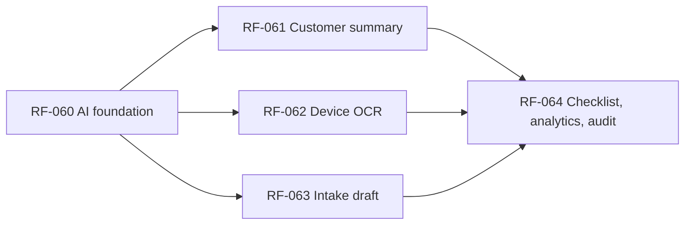

# Milestone 7 — AI assistance behind feature flags

## Mục tiêu

Milestone 7 bổ sung các trợ lý AI cho nhân viên cửa hàng nhưng không cho AI tự thay đổi dữ liệu nghiệp vụ. Mọi kết quả AI là bản nháp, được kiểm tra theo JSON Schema, gắn nhãn `AI draft` và chỉ có hiệu lực sau khi nhân viên xem, sửa hoặc xác nhận qua luồng nghiệp vụ hiện có.

DeepSeek là provider suy luận đầu tiên. Toàn bộ domain và application code chỉ phụ thuộc `AiGateway`; kiểu dữ liệu, lỗi và SDK riêng của DeepSeek không được vượt ra ngoài adapter. Test và CI dùng provider giả lập xác định được kết quả.

## Phạm vi

- Feature flag toàn cục và theo từng cửa hàng/từng capability; mặc định tắt.
- AI Gateway độc lập provider, DeepSeek adapter, fake adapter và worker nền.
- Giới hạn dữ liệu gửi provider, redaction, timeout, output-size limit, circuit breaker và ngân sách theo cửa hàng.
- Bốn capability: customer-safe summary, device OCR, intake draft từ text/transcript và checklist suggestion.
- Theo dõi trạng thái run, review outcome, mức chỉnh sửa, thời gian tiết kiệm và chi phí ước tính.
- Giao diện chỉ hiển thị draft và yêu cầu thao tác xác nhận rõ ràng.

## Ngoài phạm vi

- AI tự đổi trạng thái phiếu, chẩn đoán, báo giá, chỉ định kỹ thuật viên, kết quả QC, thanh toán hoặc bảo hành.
- Chatbot công khai và trả lời tự động cho khách hàng.
- Fine-tuning, RAG trên toàn bộ dữ liệu cửa hàng hoặc tìm kiếm vector.
- Gửi PII, credential, token, mật khẩu thiết bị hoặc lịch sử không liên quan cho provider.
- Provider speech-to-text thực tế. RF-063 định nghĩa gateway và luồng audio, nhưng production audio chỉ được bật sau khi chọn và kiểm duyệt một provider speech-to-text. DeepSeek vẫn là provider tạo intake draft từ transcript.

## Nguyên tắc bất biến

1. Request nghiệp vụ chỉ tạo `AiRun` và outbox job trong một transaction rồi trả `202`; không gọi provider trong HTTP request.
2. Worker chỉ đọc dữ liệu tối thiểu mà người yêu cầu có quyền đọc, redaction trước gateway và không log prompt, output, ảnh, transcript, destination, token hoặc provider body.
3. Output phải parse được và đạt schema của đúng capability. Output sai làm run `FAILED` với `AI_OUTPUT_INVALID`; không áp dụng một phần.
4. AI không phải nguồn sự thật. Việc lưu thay đổi dùng command/API nghiệp vụ hiện có và vẫn chịu validation, version concurrency, tenant guard và permission guard.
5. `inputReference` chỉ chứa ID, enum và snapshot tối thiểu đã redaction cần cho worker; không trả về client. Outbox chỉ chứa `aiRunId`, `shopId`, `capability` và `schemaVersion`.
6. API không trả provider body, prompt nội bộ, raw usage response, secret hoặc dữ liệu tenant khác.
7. Mọi capability cần global flag và shop capability flag cùng bật. Audio cần thêm audio sub-flag và transcription provider hợp lệ.
8. Cùng `Idempotency-Key` và payload trả cùng run; cùng key với payload khác trả conflict. Một draft chỉ được review một lần.
9. Cross-tenant luôn trả `404` theo quy ước hiện tại. Public user không có quyền gọi hoặc đọc AI run.
10. Provider failure, timeout, budget exhaustion hoặc circuit breaker không chặn luồng sửa chữa thủ công.

## Contract chung

### Trạng thái run

`QUEUED -> RUNNING -> SUCCEEDED | FAILED`

- `SUCCEEDED` nghĩa là output đã đạt schema và đang chờ review hoặc đã được chấp nhận.
- `REJECTED` được giữ để tương thích schema hiện tại và chỉ dùng khi nhân viên từ chối một draft đã thành công.
- Review outcome được lưu riêng: `ACCEPTED_UNCHANGED`, `ACCEPTED_EDITED` hoặc `REJECTED`.
- Run ở trạng thái terminal không được gọi provider lại. Muốn thử lại phải tạo run mới với idempotency key mới.

### API dùng chung

- `GET /api/v1/ai/runs/{aiRunId}`: đọc trạng thái và output an toàn trong tenant.
- `POST /api/v1/ai/runs/{aiRunId}/review`: ghi nhận review, tính edit distance trên server rồi loại bỏ bản reviewed output khỏi request lifecycle; endpoint này không sửa domain entity.
- `GET /api/v1/settings/ai`: OWNER xem flag và ngân sách.
- `PATCH /api/v1/settings/ai/{capability}`: OWNER bật/tắt capability hoặc đổi ngân sách với optimistic concurrency.
- Các endpoint tạo run bắt buộc `Idempotency-Key` và được định nghĩa ở RF tương ứng.

`AiRunResponse` không chứa `inputReference`. Output chỉ xuất hiện khi run `SUCCEEDED` hoặc `REJECTED`; run thất bại chỉ có error code ổn định, không có provider message.

### Authorization

- OWNER và RECEPTIONIST có thể chạy/review AI theo RBAC hiện có.
- TECHNICIAN chỉ được chạy/review trên phiếu cùng tenant mà họ đang được active assignment và trạng thái cho phép.
- OWNER quản lý feature flags, budget và xem analytics tổng hợp.
- Capability-specific rules có thể siết chặt nguồn dữ liệu nhưng không được nới quyền nền ở trên.

### Provider boundary

`AiGateway.generate(request): Promise<AiGatewayResult>` nhận capability, prompt version, schema version, input đã redaction, timeout và output limit. Kết quả chuẩn hóa gồm parsed output, usage, latency, provider/model alias và classification lỗi. Application code không import DeepSeek SDK/type.

Adapter đầu tiên dùng DeepSeek Responses API qua base URL cấu hình, structured JSON output và image data URL cho OCR. Model là cấu hình, không hard-code trong domain. Nguồn tham khảo khi triển khai: [DeepSeek Responses API guide](https://api-docs.deepseek.com/guides/responses_api/) và [Responses API reference](https://api-docs.deepseek.com/api/create-response/).

Biến môi trường dự kiến:

- `AI_ENABLED=false`
- `AI_PROVIDER=fake|deepseek`
- `AI_TIMEOUT_MS`, `AI_MAX_OUTPUT_BYTES`, `AI_CIRCUIT_BREAKER_THRESHOLD`, `AI_CIRCUIT_BREAKER_COOLDOWN_MS`
- `DEEPSEEK_API_KEY`, `DEEPSEEK_BASE_URL`, `DEEPSEEK_MODEL`
- Bảng giá theo model có version trong cấu hình để server tự ước tính chi phí.

Nếu `AI_ENABLED=true` và provider là DeepSeek thì cấu hình thiếu/URL không HTTPS phải làm service fail-fast khi khởi động. CI không cần secret và luôn dùng fake provider.

## Persistence dự kiến

- `AiCapabilitySetting`: khóa `(shopId, capability)`, `enabled`, monthly/max-run budget micro-USD, `lockVersion`, người cập nhật và timestamps.
- `AiUsagePeriod`: khóa `(shopId, capability, periodStart)`, số tiền reserved/spent và `lockVersion` để chống vượt ngân sách từng capability khi tạo đồng thời.
- Mở rộng `AiRun`: start time, token usage, reserved/estimated cost, latency, review outcome, reviewer, review time, edit distance, time saved. Giữ các cột acceptance hiện có để migration tương thích.
- Outbox event `AI_RUN_REQUESTED_V1` chỉ chứa domain identifiers; worker dispatch theo event type để không ảnh hưởng notification delivery hiện có.

Budget được reserve trong cùng transaction tạo run/outbox và reconcile khi run kết thúc. Không tin chi phí do client hay provider gửi trực tiếp; chi phí được tính từ usage chuẩn hóa và bảng giá có version.

## Thứ tự và dependency

| RF | Kết quả | Dependency |
| --- | --- | --- |
| RF-060 | Gateway, persistence, flags, budget, worker, fake và DeepSeek adapter | Milestone 6 |
| RF-061 | Customer-safe summary trong workspace | RF-060 |
| RF-062 | OCR thiết bị trong intake | RF-060 |
| RF-063 | Intake draft từ text/transcript; audio qua transcription boundary | RF-060 |
| RF-064 | Checklist suggestion, settings/analytics UI và final audit | RF-061, RF-062, RF-063 |

RF-061, RF-062 và phần text của RF-063 có thể làm song song sau RF-060 nhưng nên giữ PR riêng. RF-064 chỉ bắt đầu sau khi ba capability trước ổn định để audit contract chung.

## File ownership

| Khu vực | RF owner |
| --- | --- |
| Prisma AI settings/usage/run schema và migration nền | RF-060 |
| AI shared module, gateway, worker dispatch, flags, budget, review API | RF-060 |
| Customer summary API/UI/schema | RF-061 |
| Device OCR API/UI/schema | RF-062 |
| Intake draft text/audio boundary API/UI/schema | RF-063 |
| Checklist suggestion, owner settings/analytics UI và audit | RF-064 |
| `docs/openapi.yaml`, `docs/error-codes.md`, `docs/ai-contracts.md` | RF thay đổi contract phải cập nhật trong cùng PR |

Một RF không được refactor file thuộc capability khác nếu không có lỗi contract chung được ghi rõ. Shared foundation cần thay đổi sau RF-060 phải được tách commit hoặc giải thích trong PR.

## Exit criteria Milestone 7

- Bốn capability chạy qua cùng provider-neutral gateway và fake provider trong CI.
- DeepSeek adapter có config validation, structured output, timeout, redaction, cost accounting và không rò dữ liệu trong log/error/outbox.
- Tất cả AI feature mặc định tắt; owner có thể bật theo capability và đặt budget.
- AI output luôn là draft có nhãn, không tự sửa domain và có review telemetry.
- Provider lỗi hoặc feature tắt vẫn cho phép hoàn thành toàn bộ quy trình thủ công.
- Test bao phủ role, tenant, assignment, idempotency, concurrency, budget, timeout, invalid output, PII, empty/loading/error, 360px và browser E2E.
- Format, lint, typecheck, unit/integration/E2E, build, migration deploy/status và seed đều đạt.

## Quy ước làm việc

Mỗi RF dùng branch và Pull Request riêng. Trước khi code, AI phải tóm tắt contract, dữ liệu được phép rời hệ thống, transaction boundary, quyền, file ownership và kế hoạch test. Không sửa public contract âm thầm; nếu tài liệu mâu thuẫn thì dừng phần mâu thuẫn và báo rõ.
